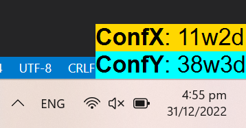
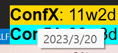
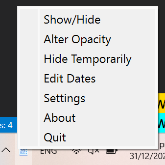
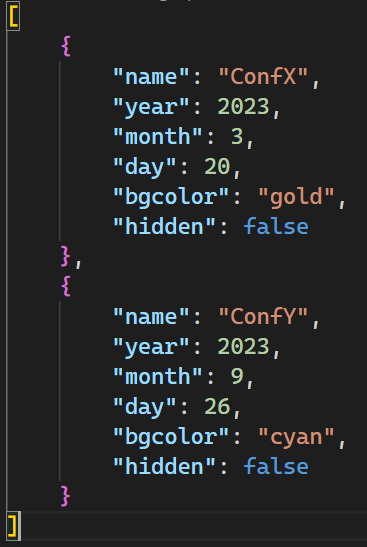
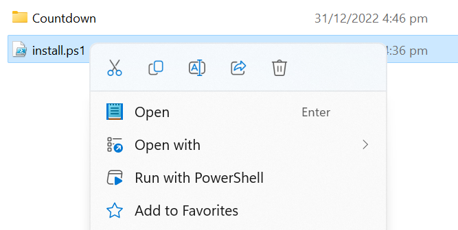

# Countdown of Remaining Days

⏱️ A free and offline countdown widget to remind you of the remaining days to important events.

🖥️ Currently, this app only supports Windows.

## Features
- A desktop widget that shows the remaining days to a specific event.
    - 
- Three levels of transparency. Double-click the widget to quickly alter the transparency level.
- Hover on the widget to show the date of the event.
    - 
- Double-right-click the widget to temporarily hide the widget (so that you can click the area covered by the widget)
- Double-click the tray icon to permanently show or hide the widget.
- Click the **Setting** in the menu will launch a text editor to edit the dates in `dates.json` file.
    - 
    - `bgcolor` is the background color of the corresponding date in the widget. If `bgcolor` is `random`, the app will randomly pick a color in `config.json`.
    - If `hidden` is `true`, the corresponding date will be hidden.
        - 
    - Change to the `dates.json` will immediately take effect.


## How to Install
- Download the latest release from the [release page](https://github.com/yttty/countdown-widget/releases) and unzip
- Right-click on the install.ps1 and select Run with PowerShell.
    - 

## How to Contribute
1. Install the dependencies
```sh
pip install -r requirements.txt
```
2. Modify the code
3. Test building an executable package with `pyinstaller`
```sh
pyinstaller --noconfirm .\countdown.spec
```
4. Generate and zip the package
```powershell
# powershell script
create-release.ps1
```
